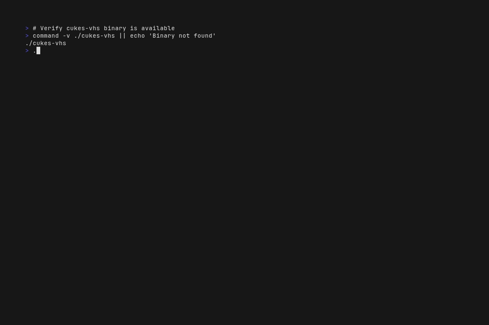
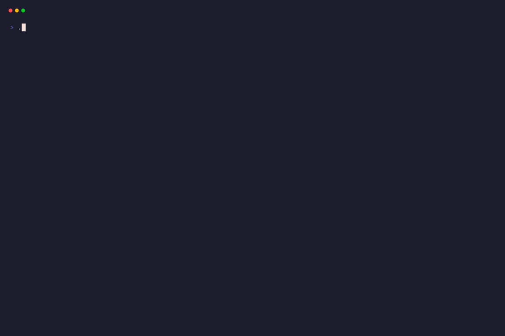

# cukes-vhs

cukes-vhs is a Go CLI tool that converts Gherkin BDD scenarios into VHS tape files for automated terminal recordings. It's a component of the cukes-vhs ecosystem.

## Overview
- Parses .feature files in Gherkin format.
- Maps BDD steps to VHS commands like Type, Enter, and Sleep.
- Generates .tape files for charmbracelet/vhs.
- Validates generated tapes against golden baselines.
- Supports listing, generating, running, and updating baseline tapes.

## Installation

```bash
go install github.com/boodah-consulting/cukes-vhs/cmd/cukes-vhs@latest
```

Or build from source:
```bash
git clone https://github.com/boodah-consulting/cukes-vhs.git
cd cukes-vhs
make build
```

## Usage

```bash
# List available scenarios
cukes-vhs list

# Generate tape files from Gherkin scenarios
cukes-vhs generate

# Run generated tapes
cukes-vhs run

# Update golden baselines
cukes-vhs update-baseline
```

## Demo

### Help Display


### List Scenarios


### Generate Tapes


## Development

### Prerequisites
- Go 1.25.4+
- Node.js for commitlint
- golangci-lint v2.8.0+

### Setup
```bash
make install-git-hooks
make ci-install-tools
npm install
```

### Common Commands
```bash
make help          # Show all available targets
make build         # Build binary with version injection
make test          # Run tests with Ginkgo
make test-race     # Run tests with race detector
make coverage      # Run tests with coverage report
make golangci-lint # Run full lint suite (40+ linters)
make check-compliance  # Full compliance check
make pre-commit    # Pre-commit checks (fmt, vet, staticcheck, test)
make ci-local      # Run full CI pipeline locally
```

### Project Structure
```
cmd/
  cukes-vhs/       # CLI entry point
  docblocks/       # Documentation analyzer
internal/
  cukesvhs/          # Core library (parser, generator, renderer, etc.)
    templates/     # VHS tape templates (go:embed)
tools/
  analyzers/
    docblocks/     # Custom static analyzer for doc standards
scripts/           # Build and CI scripts
.git-hooks/        # Git commit hooks
```

### Testing
Tests follow the BDD style and use Ginkgo and Gomega:
```bash
make test          # Standard test run
make test-race     # With race detector
make coverage      # With coverage (95% threshold)
```

### Code Quality
- Enforces 40+ golangci-lint linters.
- Uses custom docblocks analyzer for documentation standards.
- Enforces conventional commits via commitlint.
- Tracks AI-assisted commits with attribution.

### Versioning
This project uses semantic-release with conventional commits. The build process injects the version from the VERSION file at build time through ldflags.

## Commit Conventions
This project follows [Conventional Commits](https://www.conventionalcommits.org/):
```
type(scope): description

Allowed types: feat, fix, docs, style, refactor, test, chore, perf, ci, build, revert
Allowed scopes: parser, generator, template, validator, golden, renderer, mapping, cli, ci, deps, repo, lint
```

## Licence
MIT, see [LICENSE](LICENSE) for details.
